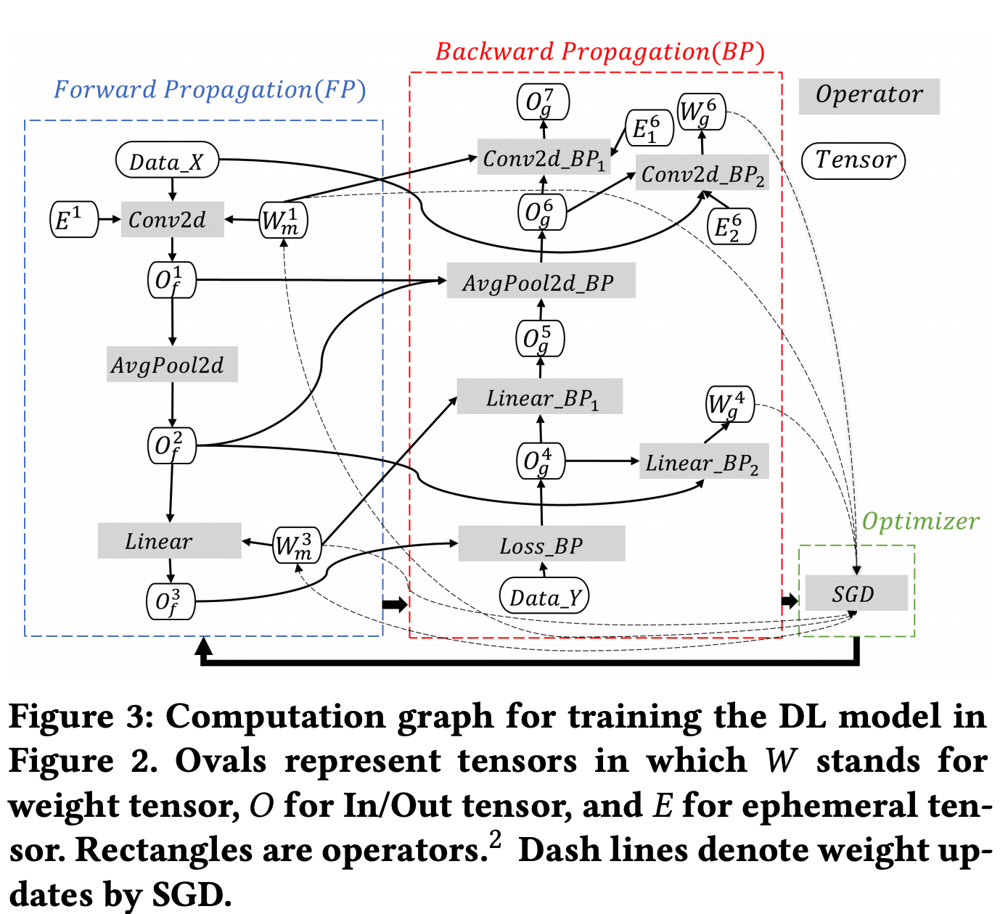

* 아래 그림은 논문에서 사용한 Pytorch로 작성된 간단한 코드구조이다.

* 아래 그림은 위의 코드에 대한 것의 memory 사용을 보여준다. $E$, $O$, $W$에 대한 설명은 아래 [table 3]()을 보자.

* 아래 그림은 연산이 진행됨에 따라 쓸모 없는 memory($E^1$)은 버려지는 것을 알수 있다.

* 아래 그림은 Deep Learning model을 만들기 위해 꼭 필요한 memory들이다.
* Weight Tensor
  * Category의 이름이 그대로 설명해주고 있다.
* In/Out Tensor
  * 처음 input을 Memory에 올린 initial input
  * 중간에 output으로 생성된(다음 연산의 input) Operator Input
  * Forward propagation의 결과인 Forward Output
  * Back Prop시에 생성되는 Output Gradient. 이는 연산 중간 생성된 memory이다.
* Ephemeral Tensor(수명이 짧은, 단명의)
  * cuDNN Workspace
    * conv 연산을 할때,cuDNN은 특수한 알고리즘으로 구성되어 있음. 그때 여분의 memory가 필요함. 그 때 사용함.(memory를 쓰는 대신, 속도를 빠르게 가져갔다.)
  * Temporary Tensor는 예를들어 padding이 있다.
* Resident Buffer - 모르겠음
  * CUDA Context
  * Internal Tensor Fragmentation
  * Allocator Reservation

* 아래 그림은 맨 위 코드에 해당하는 것의 memory사용이다.
* $S_f$는 data type. float32, int, double 등.

* 아래 그림은 tf, pytorch, mxnet의 memory사용비율을 나타냄.
* mxnet>tf>pytorch순으로 좋음.
>
$$
\% \text{error}=\frac{|\text{Est.}-\text{Real}|}{\text{Real}} \times 100
$$

* SI(Shape inference)가 뭔지는 아직 모름.

* 배치 사이즈마다 다른 memory consumption

---
* 아래 그림은 논문(Microsoft)에서 제시하는 새로운 Deep Learning API(architecture)인 DNNMem에 대한 구조이다. memory적으로 매우 효율적이다. 줄인 방법은 자세히 보지 않았다. 논문 참조.

